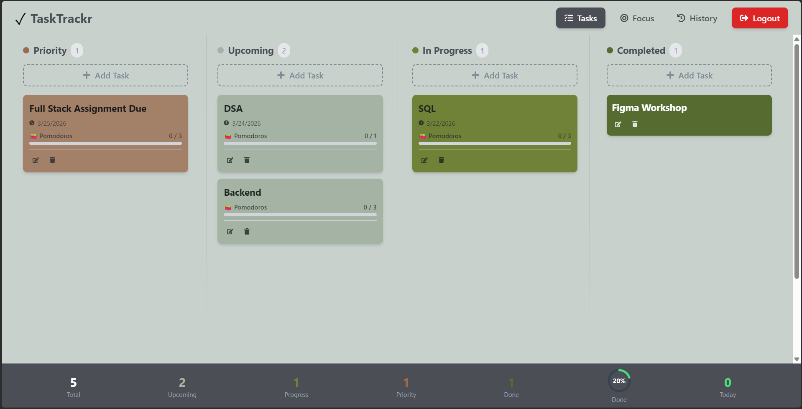
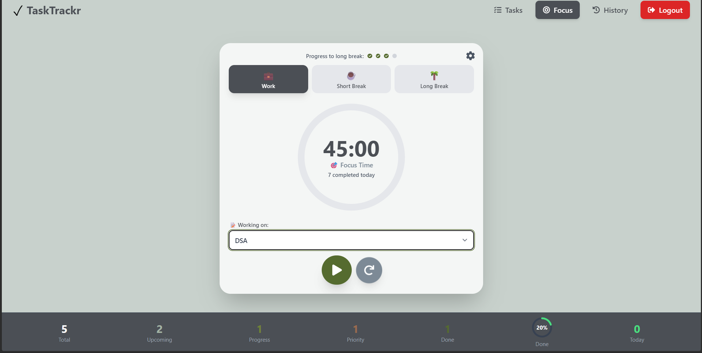
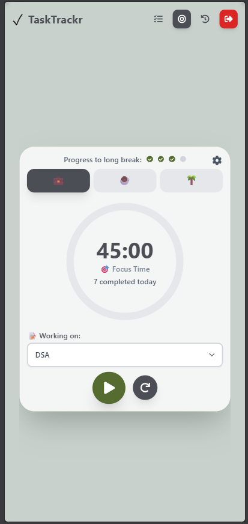

# 📋 TaskTrackr — Full-Stack Task Management Application

> A beautiful, feature-rich productivity app combining Kanban boards with Pomodoro technique for maximum focus and organization. Built with React 18, Node.js/Express, and SQLite for seamless task management and time tracking.

     

---

## 🎬 Project Preview

### Dashboard & Kanban Board


### Pomodoro Timer Interface


### Mobile Responsive Design


---

## ✨ Features

### 🎯 Core Functionality
- **📋 Kanban Board** - Visual task management with 4 columns (Priority, Upcoming, In Progress, Completed)
- **🍅 Pomodoro Timer** - Built-in focus timer with customizable work/break intervals (25 min default)
- **✨ Drag & Drop** - Smooth task movement between categories using @dnd-kit library
- **📊 Real-Time Analytics** - Live dashboard with completion rates and statistics
- **🔐 Secure Authentication** - User registration and login with bcryptjs password hashing
- **⚡ Instant Updates** - No page refresh needed, real-time task state synchronization

### 🎨 Design & UX
- **Custom Color Palette** - Eye-comfort optimized sage and olive theme
- **🌈 Smooth Animations** - Framer Motion powered transitions and micro-interactions
- **📱 Responsive Design** - Works seamlessly on desktop (1440px+), tablet (768px+), and mobile (320px+)
- **🎯 Category-Specific Styling** - Each task category has unique colors for easy identification
- **✅ Inline Confirmations** - No jarring popups, smooth inline delete confirmations
- **🎭 Visual Feedback** - Hover effects, loading spinners, and success/error toasts

### 🚀 Advanced Features
- **💾 Task Persistence** - No refresh needed for any CRUD operations (Create, Read, Update, Delete)
- **⏱️ Timer Persistence** - Pomodoro timer continues even when navigating between pages
- **📱 Network Access** - Auto-detects IP for seamless mobile device access on same WiFi
- **📈 Pomodoro Progress** - Visual progress bars and counters showing time invested per task
- **🎯 Smart Task Selector** - Dropdown shows favorite tasks with scroll for more
- **🔄 Category Auto-Transitions** - Tasks auto-set to "completed" with timestamp when moved to Completed column

---

## 🛠️ Tech Stack

### Frontend Architecture
| Technology | Version | Purpose | Why Chosen |
|------------|---------|---------|-----------|
| **React** | 18.0+ | UI framework with hooks | Modern component-based architecture, excellent ecosystem |
| **Tailwind CSS** | 3.3+ | Utility-first styling | Rapid UI development, consistent design system |
| **Framer Motion** | 10.16+ | Smooth animations | Professional micro-interactions, easy implementation |
| **@dnd-kit** | 7.0+ | Drag & drop functionality | Lightweight, accessible, framework-agnostic |
| **React Router v6** | 6.14+ | Client-side routing | Dynamic page navigation, nested routes support |
| **Axios** | 1.4+ | HTTP client | Promise-based, interceptor support for auth tokens |
| **React Hot Toast** | 2.4+ | Notifications | Beautiful, accessible toast notifications |
| **React Icons** | 4.10+ | Icon library | Consistent, lightweight icon set |

### Backend Architecture
| Technology | Version | Purpose | Why Chosen |
|------------|---------|---------|-----------|
| **Node.js** | 16-20 | Runtime environment | Fast, non-blocking I/O, vast npm ecosystem |
| **Express.js** | 4.18+ | REST API framework | Minimal, flexible, industry-standard framework |
| **SQLite 3** | 3+ | Database (file-based) | No server needed, perfect for development/small projects |
| **bcryptjs** | 2.4+ | Password hashing | Secure password handling with salt rounds |
| **CORS** | 2.8+ | Cross-origin requests | Allows frontend (port 3000) to communicate with backend (port 8080) |
| **dotenv** | 16+ | Environment variables | Secure config management without exposing secrets |

### Development Tools
| Tool | Purpose |
|------|---------|
| **npm/yarn** | Dependency management |
| **Git** | Version control |
| **VS Code** | Code editor |
| **Browser DevTools** | Debugging & performance |

---

## 📦 Installation & Local Deployment

### Prerequisites
Before you begin, ensure you have the following installed:

- **Node.js** (v16 or higher) - [Download from nodejs.org](https://nodejs.org/)
  - Comes with npm (Node Package Manager)
  - Verify installation: `node --version` and `npm --version`
- **Git** (optional, for cloning) - [Download from git-scm.com](https://git-scm.com/)


### Step 1: Clone or Download the Project

#### Option A: Using Git
```bash
git clone <repository-url>
cd WebTech-MiniProject
```

#### Option B: Download ZIP
1. Download the project as ZIP
2. Extract to your desired location
3. Open terminal in the project folder

### Step 2: Backend Setup (Node.js + SQLite)

#### 2.1 Navigate to Backend Directory
```bash
cd nodejs-backend
```

#### 2.2 Install Dependencies
```bash
npm install
```
This installs all required packages listed in `package.json`:
- express (API framework)
- sqlite3 (database)
- bcryptjs (password hashing)
- cors (cross-origin requests)
- dotenv (environment variables)

**Expected output:**
```
added XXX packages in X.XXs
```

#### 2.3 Verify Database Setup
The database will be created automatically on first run. Check the `.env` file:

```env
PORT=8080
CORS_ORIGIN=*
NODE_ENV=development
```

You can modify `PORT` if 8080 is already in use.

#### 2.4 Start the Backend Server
```bash
npm start
```

**Expected output:**
```
🚀 TaskTrackr backend running on http://localhost:8080
📝 API base URL: http://localhost:8080/api
Connected to SQLite database at: ./database/tasktrackr.db
Database schema initialized successfully
```

#### 2.5 Verify Backend is Running
Open a browser and navigate to:
```
http://localhost:8080/health
```

You should see:
```json
{"status":"ok","message":"TaskTrackr backend is running"}
```

✅ **Backend is ready!** Keep this terminal open and continue with frontend setup.

---

### Step 3: Frontend Setup (React)

#### 3.1 Open New Terminal (Keep Backend Running!)
Open another terminal window/tab in your project root:
```bash
cd frontend
```

#### 3.2 Install Dependencies
```bash
npm install
```

This installs all React packages and dependencies.

#### 3.3 Verify API Configuration
The frontend is already configured to use the correct backend URL.

Check `frontend/src/api/axiosInstance.js`:
```javascript
const getBaseURL = () => {
  const hostname = window.location.hostname;
  
  if (hostname !== 'localhost' && hostname !== '127.0.0.1') {
    return `http://${hostname}:8080/api`;
  }
  
  return 'http://localhost:8080/api';
};
```

✅ Configuration is correct! No changes needed.

#### 3.4 Start Development Server
```bash
npm start
```

**Expected output:**
```
webpack compiled successfully
On Your Network: http://192.168.x.x:3000
Local: http://localhost:3000
```

#### 3.5 Access the Application
Your browser should automatically open:
```
http://localhost:3000
```

If not, manually navigate to it.

✅ **Application is ready!**

---

### Complete Setup Checklist

- [ ] Node.js installed (`node --version` shows v16+)
- [ ] Backend dependencies installed (`cd nodejs-backend`, then `npm install`)
- [ ] Backend running on `http://localhost:8080` (health check passes)
- [ ] Database created at `nodejs-backend/database/tasktrackr.db`
- [ ] Frontend dependencies installed (`cd frontend`, then `npm install`)
- [ ] Frontend running on `http://localhost:3000`
- [ ] Can see login page in browser
- [ ] Created account successfully
- [ ] Tasks create/edit/delete without errors

---

### Quick Start Script (Windows PowerShell)

Save this as `start-project.ps1` in the project root:

```powershell
# Start backend
Start-Process -FilePath "cmd.exe" -ArgumentList "/k cd nodejs-backend && npm start"

# Wait for backend to start
Start-Sleep -Seconds 3

# Start frontend
Start-Process -FilePath "cmd.exe" -ArgumentList "/k cd frontend && npm start"

Write-Host "✅ Both servers starting..."
Write-Host "📝 Backend: http://localhost:8080"
Write-Host "🎨 Frontend: http://localhost:3000"
```

Run it:
```bash
powershell -ExecutionPolicy Bypass -File start-project.ps1
```

---

### Quick Start Script (Linux/Mac Bash)

Save this as `start-project.sh` in the project root:

```bash
#!/bin/bash

# Start backend in background
cd nodejs-backend
npm start &
BACKEND_PID=$!

# Wait for backend to start
sleep 3

# Start frontend in new terminal
cd ../frontend
npm start

# Cleanup on exit
kill $BACKEND_PID
```

Run it:
```bash
chmod +x start-project.sh
./start-project.sh
```

---

## 🚀 User Guide & Features

### 🔐 Authentication

#### Register a New Account
1. On the login page, click "📝 Don't have an account? Register here"
2. Fill in the registration form:
   - **Full Name** - Your name
   - **Email** - Unique email address
   - **Password** - Minimum 6 characters
3. Click "Register" button
4. You'll be logged in automatically and redirected to dashboard

#### Login to Existing Account
1. Enter your email and password
2. Click "Login"
3. You'll be taken to your personalized dashboard

#### Logout
- Click your email in navbar or sidebar
- Select "Logout"

---

### 📋 Task Management

#### Create a Task
1. Navigate to **Tasks** page (📋 icon in navbar)
2. Click **"➕ Add Task"** button in any column
3. Fill in the task form:
   - **Task Title** * (required) - Task name
   - **Description** - Details about the task
   - **Category** - Choose from:
     - 🔴 Priority
     - 📅 Upcoming
     - ⚙️ In Progress
     - ✅ Completed
   - **Due Date** - When the task is due
   - **Priority Level** - Low, Medium, or High
   - **Estimated Pomodoros** - How many 25-min sessions needed
4. Click **"Create Task"** button
5. Task appears in the selected column immediately

#### View Task Details
- All task details visible on the task card:
  - Title and description
  - Due date (if set)
  - Priority indicator (🔥 for high)
  - Estimated pomodoros
  - Completed pomodoros counter

#### Edit a Task
1. Click the **✏️ Edit** button on any task card
2. Modal opens with all task fields
3. Update any information:
   - Change title, description, due date
   - Adjust priority or estimated pomodoros
   - Move to different category
4. Click **"Update Task"** to save changes
5. Changes are reflected immediately (no page refresh needed)

#### Delete a Task
1. Click the **🗑️ Delete** button on task card
2. Inline confirmation appears
3. Click **"Yes"** to confirm deletion
4. Task is removed immediately

#### Move Tasks (Drag & Drop)
1. Click and hold on a task card
2. Drag to another column
3. Release the mouse
4. Task updates its category instantly

**Categories:**
- **Priority** - Urgent tasks
- **Upcoming** - Scheduled tasks
- **In Progress** - Currently working on
- **Completed** - Finished tasks (moves to completed column)

---

### 🍅 Pomodoro Timer

#### Access the Timer
1. Click **🎯 Focus** in the navbar
2. You're in the Pomodoro timer interface

#### Timer Types
- **💼 Work Session** - 25 minutes (default)
- **☕ Short Break** - 5 minutes (default)
- **🌴 Long Break** - 15 minutes (default)

#### Start a Timer
1. Select the session type using the buttons
2. (Optional) Choose a task from the dropdown to track progress
3. Click the **▶️ Play** button to start
4. Timer counts down with visual progress

#### Timer Controls
- **⏸️ Pause** - Pause the timer
- **▶️ Resume** - Continue from pause
- **⏹️ Stop** - Cancel the session
- Audio notification plays when time is up

#### Customize Timer Durations
1. Click **⚙️ Settings** in the Focus page
2. Adjust durations:
   - Work duration (1-999 minutes)
   - Short break duration (1-999 minutes)
   - Long break duration (1-999 minutes)
   - Sessions until long break (1-10)
3. Click **Save Settings**
4. Settings apply to new sessions

#### Pomodoro History
1. Click **📊 History** in the navbar
2. View all completed pomodoro sessions:
   - Session type (Work/Break)
   - Date and time
   - Duration
   - Associated task (if any)
   - Notes
3. Filter by session type if needed

---

### 📊 Dashboard & Statistics

The dashboard shows:
- **Total Tasks** - Count of all your tasks
- **Completed Tasks** - Tasks you've finished
- **Completion Rate** - Percentage of completed tasks
- **Tasks by Category** - Breakdown of tasks in each column
- **Pomodoros Invested** - Total time spent in focus sessions

---

### 📱 Mobile Access

#### Access from Same Network
1. Find your computer's IP address:
   - **Windows**: Open Command Prompt → Type `ipconfig` → Find IPv4 Address
   - **Mac/Linux**: Open Terminal → Type `ifconfig` → Find inet address
   
2. From your mobile device (on same WiFi):
   - Frontend: `http://YOUR_IP:3000`
   - Example: `http://192.168.1.100:3000`

3. The app automatically detects your IP and backend connection works seamlessly

#### Features on Mobile
- ✅ Full Kanban board experience
- ✅ Drag and drop works on touch
- ✅ Responsive layout adapts to screen size
- ✅ All features available (timer, history, etc.)
- ✅ Auto-saves all changes

---

## 📱 Mobile Access

To access TaskTrackr from your phone on the same WiFi network:

1. **Find Your Computer's IP Address:**
   - Windows: Open Command Prompt → Type `ipconfig` → Note IPv4 Address
   - Example: `192.168.1.100`

2. **Access from Phone:**
   - Frontend: `http://YOUR_IP:3000`
   - Example: `http://192.168.1.100:3000`
   - Backend auto-detects and works correctly!

3. **Troubleshooting:**
   - Ensure both devices are on the same WiFi
   - Verify both servers running:
     - Backend check: `http://YOUR_IP:8080/health` should return OK
     - Frontend should load at `http://YOUR_IP:3000`
   - Check Windows Firewall allows Node.js (port 8080)

---

## 📁 Project Structure

```
TaskTrackr/
│
├── 📂 frontend/                            # React.js Frontend Application
│   ├── 📂 public/
│   │   └── index.html                     # HTML entry point
│   │
│   ├── 📂 src/
│   │   ├── 📂 api/
│   │   │   └── axiosInstance.js           # Axios configuration with auto IP detection
│   │   │
│   │   ├── 📂 components/
│   │   │   ├── 📂 focus/
│   │   │   │   └── PomodoroTimer.jsx      # Timer interface & controls
│   │   │   │
│   │   │   ├── 📂 layout/
│   │   │   │   ├── Navbar.jsx             # Top navigation bar
│   │   │   │   ├── Sidebar.jsx            # Side navigation
│   │   │   │   └── DashboardFooter.jsx    # Footer with statistics
│   │   │   │
│   │   │   └── 📂 tasks/
│   │   │       ├── TaskBoard.jsx          # Main kanban board
│   │   │       ├── TaskCard.jsx           # Individual task card
│   │   │       ├── TaskColumn.jsx         # Kanban column container
│   │   │       └── TaskModal.jsx          # Create/Edit task modal
│   │   │
│   │   ├── 📂 pages/
│   │   │   ├── FocusPage.jsx              # Pomodoro timer page
│   │   │   ├── HistoryPage.jsx            # Pomodoro history logs
│   │   │   ├── LoginPage.jsx              # Login interface
│   │   │   ├── RegisterPage.jsx           # Registration interface
│   │   │   └── TasksPage.jsx              # Main task management page
│   │   │
│   │   ├── App.jsx                        # Root React component
│   │   ├── index.js                       # React DOM entry point
│   │   └── index.css                      # Global styles
│   │
│   ├── package.json                       # Frontend dependencies
│   ├── tailwind.config.js                 # Tailwind CSS configuration
│   └── postcss.config.js                  # PostCSS configuration
│
├── 📂 nodejs-backend/                     # Node.js + Express Backend (🆕)
│   ├── 📂 config/
│   │   └── database.js                    # SQLite database setup & initialization
│   │
│   ├── 📂 controllers/
│   │   ├── authController.js              # Authentication logic
│   │   ├── tasksController.js             # Task CRUD operations
│   │   └── pomodoroController.js          # Pomodoro session management
│   │
│   ├── 📂 routes/
│   │   ├── auth.js                        # /api/auth endpoints
│   │   ├── tasks.js                       # /api/tasks endpoints
│   │   └── pomodoro.js                    # /api/pomodoro endpoints
│   │
│   ├── 📂 database/
│   │   └── tasktrackr.db                  # SQLite database (auto-created)
│   │
│   ├── .env                               # Environment variables
│   ├── .gitignore                         # Git ignore rules
│   ├── package.json                       # Backend dependencies
│   ├── server.js                          # Express server entry point
│   └── NODEJS_SETUP.md                    # Detailed backend setup guide
│
├── 📂 database/
│   └── schema.sql                         # Original MySQL schema (reference)
│
├── 📂 Template/                           # UI template files
├── DATABASE_SETUP.md                      # Database documentation
├── TaskTrackr_Project_Idea.txt            # Original project concept
├── PROJECT_REPORT.md                      # Project report
├── BUGFIX_REPORT.md                       # Bug fixes documentation
├── sync_backend.bat                       # Batch script for backend sync
└── README.md                              # This file

```

---

## 🔌 API Endpoints Reference

### Base URL
```
http://localhost:8080/api
```

### Authentication Endpoints

| Method | Endpoint | Purpose | Request Body |
|--------|----------|---------|--------------|
| `POST` | `/auth/register` | Register new user | `{name, email, password}` |
| `POST` | `/auth/login` | Login user | `{email, password}` |

**Register Response:**
```json
{
  "status": "success",
  "message": "User registered",
  "data": {
    "id": 1,
    "name": "John Doe",
    "email": "john@example.com"
  }
}
```

**Login Response:**
```json
{
  "status": "success",
  "message": "User logged in",
  "data": {
    "id": 1,
    "name": "John Doe",
    "email": "john@example.com"
  }
}
```

---

### Task Management Endpoints

| Method | Endpoint | Purpose | Parameters |
|--------|----------|---------|------------|
| `GET` | `/tasks?user_id=1` | Fetch all user tasks | `user_id` (query) |
| `POST` | `/tasks` | Create new task | JSON body |
| `PUT` | `/tasks/:id` | Update task | `id` (URL), JSON body |
| `DELETE` | `/tasks/:id` | Delete task | `id` (URL) |

**Create Task - Request:**
```json
{
  "user_id": 1,
  "title": "Complete project",
  "description": "Finish the task management app",
  "category": "in_progress",
  "due_date": "2026-04-01",
  "priority_level": "high",
  "estimated_pomodoros": 5
}
```

**Create Task - Response (201 Created):**
```json
{
  "status": "success",
  "message": "Task created",
  "data": {
    "id": 15
  }
}
```

**Update Task - Request:**
```json
{
  "title": "Updated title",
  "category": "completed",
  "priority_level": "medium"
}
```

**Get Tasks - Response:**
```json
{
  "status": "success",
  "data": [
    {
      "id": 1,
      "user_id": 1,
      "title": "Task 1",
      "description": "Details",
      "category": "upcoming",
      "priority_level": "high",
      "estimated_pomodoros": 3,
      "completed_pomodoros": 1,
      "is_completed": false,
      "due_date": "2026-04-01",
      "created_at": "2026-03-23T10:00:00Z",
      "updated_at": "2026-03-23T10:00:00Z"
    }
  ]
}
```

---

### Pomodoro Endpoints

| Method | Endpoint | Purpose | Description |
|--------|----------|---------|-------------|
| `POST` | `/pomodoro` | Save session | Create pomodoro session record |
| `GET` | `/pomodoro?user_id=1` | Get history | Retrieve all user sessions |

**Save Session - Request:**
```json
{
  "user_id": 1,
  "task_id": 5,
  "session_type": "work",
  "duration_minutes": 25,
  "started_at": "2026-03-23T10:00:00Z",
  "ended_at": "2026-03-23T10:25:00Z",
  "completed": 1,
  "notes": "Focused session"
}
```

**Get History - Response:**
```json
{
  "status": "success",
  "data": [
    {
      "id": 1,
      "user_id": 1,
      "task_id": 5,
      "task_title": "Complete project",
      "session_type": "work",
      "duration_minutes": 25,
      "started_at": "2026-03-23T10:00:00Z",
      "ended_at": "2026-03-23T10:25:00Z",
      "completed": 1,
      "notes": "Focused session",
      "created_at": "2026-03-23T10:25:00Z"
    }
  ]
}
```

---

### Error Responses

**Invalid Request (400 Bad Request):**
```json
{
  "status": "error",
  "message": "Valid Task ID is required"
}
```

**Unauthorized (401):**
```json
{
  "status": "error",
  "message": "User not found"
}
```

**Not Found (404):**
```json
{
  "status": "error",
  "message": "Task not found"
}
```

**Server Error (500):**
```json
{
  "status": "error",
  "message": "Failed to create task"
}
```

---

## 🎨 Color Palette

### Task Categories

| Category | Background | Primary Text | Secondary Text | Description |
|----------|-----------|--------------|----------------|-------------|
| **Priority** | `#B0724A` (Warm Terracotta) | `#1D1B19` | `#3E3B39` | Dark text for readability |
| **Upcoming** | `#A4B3A4` (Keep Same) | `#1F2720` | `#38433A` | Dark charcoal green |
| **In Progress** | `#92A763` (Softened Fern Green) | `#1F261E` | `#2E342A` | Dark fern green |
| **Completed** | `#708B4A` (Muted Olive) | `#5F6F3` | `#E0E4DA` | Off-white text |

### UI Elements

| Element | Color | Hex Code |
|---------|-------|----------|
| Background | Sage Mist | `#C8D1CC` |
| Navbar/Footer | Gunmetal Grey | `#4B4F55` |
| Buttons | Completed | `#556b2f` |
| Hover | In Progress | `#708238` |
| Focus Ring | Completed | `#556b2f` |

---

## � Troubleshooting Guide

### Backend Issues
1. Check Node.js is installed: `node --version`
2. Install dependencies: `npm install`
3. If port 8080 is in use, change it in `.env`:
   ```env
   PORT=8081
   ```
4. Check logs for specific errors
5. Try: `npm cache clean --force` then `npm install` again

### Database Connection Error

**Problem:** "Failed to fetch tasks" or database errors

**Solution:**
1. Check `nodejs-backend/database/tasktrackr.db` exists
2. Verify database folder has write permissions
3. Check backend `console/logs` for error details
4. Delete `.db` file and restart backend to recreate:
   ```bash
   rm nodejs-backend/database/tasktrackr.db
   npm start  # Recreates database
   ```

### Frontend Can't Reach Backend

**Problem:** API requests fail with network error

**Solution:**
1. Verify backend is running: `http://localhost:8080/health` should return OK
2. Verify axios baseURL: open `frontend/src/api/axiosInstance.js`
   - Should be: `http://localhost:8080/api` (updated automatically)
3. Check CORS is enabled in `server.js` (enabled by default)
4. Check browser console (F12) for actual error messages
5. Ensure port 8080 isn't blocked by firewall

### npm install Fails

**Problem:** Dependency installation errors

**Solution:**
```bash
# Clear npm cache and reinstall
npm cache clean --force
rm -rf node_modules package-lock.json
npm install
```

If still failing:
```bash
# Install specific versions that are known to work
npm install express@4.18.2 sqlite3@5.1.6 bcryptjs@2.4.3 cors@2.8.5 dotenv@16.0.3
```

### Tasks Not Updating Without Refresh

**Problem:** Need to refresh page to see changes

**Solution:**
- This should be fixed in the current version
- Check browser console (F12) for errors
- Verify backend is actually saving data (check database exists)

### Port 8080 Already in Use

**Problem:** "Address already in use" error

**Solution:**
```bash
# Windows: Find process using port 8080
netstat -ano | findstr :8080

# Kill the process (replace 1234 with PID from above)
taskkill /PID 1234 /F

# Or change port in .env
```

### Mobile Access Not Working

**Problem:** Can't access from phone on same network

**Solutions:**

1. **Find computer's IP address**
   ```bash
   # Windows Command Prompt
   ipconfig
   # Look for IPv4 Address (e.g., 192.168.1.100)
   ```

2. **Verify backend accessible from phone**
   ```
   From phone browser: http://YOUR_IP:8080/health
   Should return: {"status":"ok",...}
   ```

3. **Access frontend from phone**
   ```
   http://YOUR_IP:3000
   Should load login page
   ```

4. **Common issues:**
   - ❌ Devices on different WiFi networks → Connect to same WiFi
   - ❌ Firewall blocking → Add Node.js to firewall exceptions
   - ❌ IP address changed → Restart router and find new IP

---

## 🎓 Learning Outcomes & Architecture

### What You'll Learn

This project demonstrates proficiency in:

- ✅ **Full-Stack Development** - React frontend with Node.js/Express backend
- ✅ **Component Architecture** - Reusable, maintainable React components with hooks
- ✅ **State Management** - Complex React state with callbacks and props
- ✅ **Drag & Drop** - Implementing @dnd-kit for smooth task movements
- ✅ **Animations** - Advanced Framer Motion transitions and micro-interactions
- ✅ **Responsive Design** - Mobile-first CSS with Tailwind (supports 320px-2560px+)
- ✅ **RESTful APIs** - Proper CRUD operations with HTTP methods
- ✅ **Database Design** - Normalized SQLite schema with relationships
- ✅ **Authentication** - Secure password hashing with bcryptjs
- ✅ **Error Handling** - Comprehensive validation and user feedback
- ✅ **Network Programming** - HTTP client setup with Axios and interceptors
- ✅ **Performance Optimization** - Rendering optimization and efficient queries

### Architecture Patterns

1. **MVC Pattern**
   - Models: SQLite database schema
   - Views: React components
   - Controllers: Express route handlers

2. **Component-Based Design**
   - Presentational components (TaskCard, TaskColumn)
   - Container components (TaskBoard, TasksPage)
   - Custom hooks for state logic

3. **REST Architecture**
   - Resource-based endpoints (`/todos/:id`)
   - Proper HTTP methods (GET, POST, PUT, DELETE)
   - Standard JSON request/response format

4. **Security Best Practices**
   - bcryptjs for password hashing
   - CORS configuration for cross-origin requests
   - Input validation on frontend and backend
   - Environment variables for secrets

---

## 🚀 Future Enhancements

Potential features for version 2.0:

### Authentication & Security
- [ ] **JWT Authentication** - JWT tokens with expiration
- [ ] **Refresh Tokens** - Longer session persistence
- [ ] **Two-Factor Authentication** - Enhanced security
- [ ] **Password Recovery** - Email-based reset

### Task Management
- [ ] **Task Search & Filter** - Full-text search, filters by category/date
- [ ] **Task Tags** - Custom labels and organization
- [ ] **Subtasks** - Break down tasks into smaller steps
- [ ] **Task Dependencies** - Mark tasks that block other tasks
- [ ] **Recurring Tasks** - Daily, weekly, monthly tasks
- [ ] **Task Templates** - Reusable task blueprints

### Pomodoro Enhancements
- [ ] **Custom Profiles** - Different timer configs for different tasks
- [ ] **Sound Notifications** - Customizable alarm sounds
- [ ] **Statistics** - Daily/weekly/monthly pomodoro stats
- [ ] **Leaderboard** - Team productivity tracking

### User Experience
- [ ] **Dark Mode** - Toggle theme
- [ ] **Keyboard Shortcuts** - Speed up navigation
- [ ] **Task Notifications** - In-app and push notifications
- [ ] **Calendar View** - Visual task planning
- [ ] **Gantt Chart** - Project timeline view

### Team Features
- [ ] **Team Collaboration** - Share projects and tasks
- [ ] **Comments & @Mentions** - Task discussion
- [ ] **Permissions** - Role-based access control
- [ ] **Activity Log** - See who changed what and when

### Data & Export
- [ ] **Export Data** - CSV, PDF, JSON formats
- [ ] **Import Tasks** - Bulk import from files
- [ ] **Cloud Sync** - Sync across devices
- [ ] **Backup & Restore** - Automated backups

### Infrastructure
- [ ] **Progressive Web App** - Install as native app
- [ ] **Offline Support** - Work without internet
- [ ] **Native Mobile Apps** - iOS & Android apps
- [ ] **Database Migration** - PostgreSQL/MySQL support

---

## 📚 Additional Resources

### Documentation Files
- [DATABASE_SETUP.md](DATABASE_SETUP.md) - Database schema details
- [PROJECT_REPORT.md](PROJECT_REPORT.md) - Full project report
- [BUGFIX_REPORT.md](BUGFIX_REPORT.md) - Bug fixes and improvements
- [TaskTrackr_Project_Idea.txt](TaskTrackr_Project_Idea.txt) - Original concept

### External Resources
- [React Documentation](https://react.dev)
- [Node.js Documentation](https://nodejs.org/docs/)
- [Express.js Guide](https://expressjs.com/)
- [SQLite Documentation](https://www.sqlite.org/docs.html)
- [Tailwind CSS Docs](https://tailwindcss.com/docs)
- [Framer Motion Guide](https://www.framer.com/motion/)

---

## 📄 License

This project is created for **educational purposes** as part of 5th Semester Web Technologies coursework.

---

## 👨‍💻 Contributors

**Developed by:** 5th Semester Web Technologies Students

---

## 🙏 Acknowledgments

- **React Team** - For the powerful UI framework
- **Node.js & Express** - For server-side runtime and framework
- **Tailwind CSS** - For utility-first CSS styling
- **Framer Motion** - For stunning animations
- **@dnd-kit** - For accessible drag-and-drop
- **bcryptjs** - For secure password hashing
- **React Icons** - For beautiful icon set

---

## 📞 Support & Feedback

If you encounter issues:

1. ✅ Check the [Troubleshooting Guide](#-troubleshooting-guide) above
2. ✅ Verify all [Prerequisites](#prerequisites) are installed
3. ✅ Review [Installation Steps](#-installation--local-deployment)
4. ✅ Check browser **DevTools** (F12) for error messages
5. ✅ Check backend logs for API errors

---

## 🎉 Getting Started

Ready to use TaskTrackr? Follow these quick steps:

1. **Clone the repository**
2. **Install dependencies** (frontend & backend)
3. **Start the backend** (`npm start` in `nodejs-backend`)
4. **Start the frontend** (`npm start` in `frontend`)
5. **Register an account** and start tracking tasks!

**Happy task tracking! 🚀**

---

**Built with ❤️ and ☕ for Web Technologies Mini Project**

*Last Updated: March 23, 2026*
